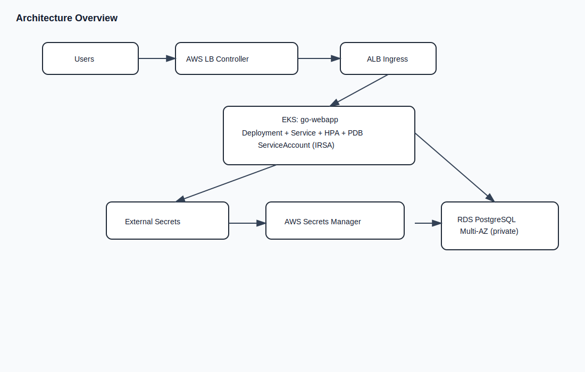
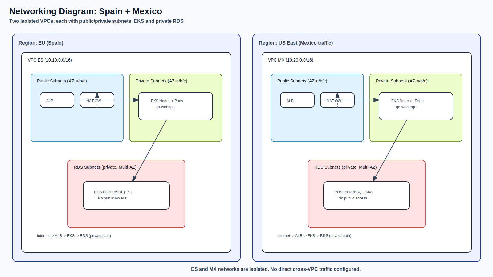
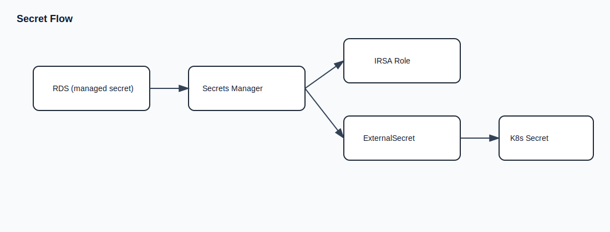
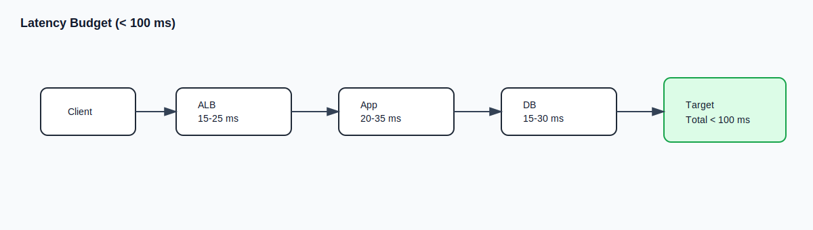
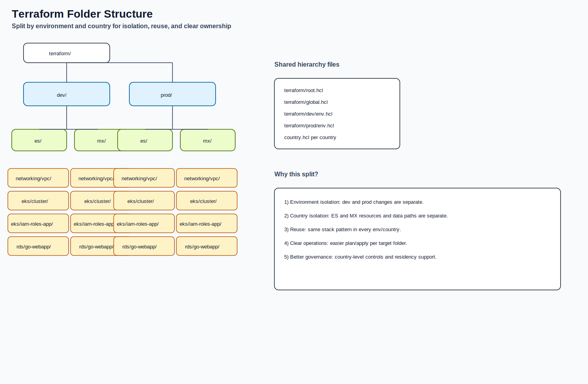

# Go Webapp Platform - Multi-Region Implementation

This repository contains the platform setup for `go-webapp` on AWS.
The solution is **multi-region** and **multi-environment**.

- Countries: Spain (`es`) and Mexico (`mx`)
- Environments: `dev` and `prod`

## Main Objective
The platform is designed to keep API latency under **100 ms** for common requests.

## Multi-Region Architecture
We run the same platform pattern in two regions:
- Spain traffic in EU region
- Mexico traffic in a US region close to Mexico

This reduces network distance and improves user response time.



## Networking by Country
Each country has its own VPC and private resources.



## Data Residency
Data residency is handled by country isolation:
- ES workloads and ES database stay in ES region setup.
- MX workloads and MX database stay in MX region setup.
- No direct cross-country VPC data path is configured by default.

This model helps with local data policy and operational isolation.

## Secret Management
Secrets are managed with AWS-native controls:
- RDS managed master password in AWS Secrets Manager.
- IRSA role for app access (no static AWS keys in pods).
- External Secrets to sync secret values into Kubernetes.



## Latency Strategy (< 100 ms)
Main actions to keep latency below 100 ms:
- Region placement close to users.
- Private traffic path (ALB -> EKS -> RDS private).
- HPA for CPU/memory scaling.
- Readiness/liveness probes for healthy routing.
- DB query optimization and observability (p50/p95/p99).



## Why Folder Structure Is Split by Env and Country
Folder split is intentional:
- `env` (`dev`/`prod`) separates lifecycle and risk.
- `country` (`es`/`mx`) separates regional resources and data scope.
- Same pattern in each path improves reuse and automation.



Example:

```text
terraform/
  dev|prod/
    es|mx/
      networking/vpc/
      eks/cluster/
      eks/iam-roles-app/
      rds/go-webapp/
```

## Kubernetes and GitOps Scope
- Helm chart: `k8s/go-webapp`
- Argo CD applications: `k8s/argocd`

## ADR Links
- [ADR-01-DECISIONS.md](./ADR-01-DECISIONS.md)
- [ADR-02-LATENCY-STRATEGY.md](./ADR-02-LATENCY-STRATEGY.md)
- [ADR-03-SECRET-MANAGEMENT.md](./ADR-03-SECRET-MANAGEMENT.md)

## Suggested Apply Order
1. `networking/vpc`
2. `eks/cluster`
3. `rds/go-webapp`
4. `eks/iam-roles-app`
5. Argo CD sync for app resources
